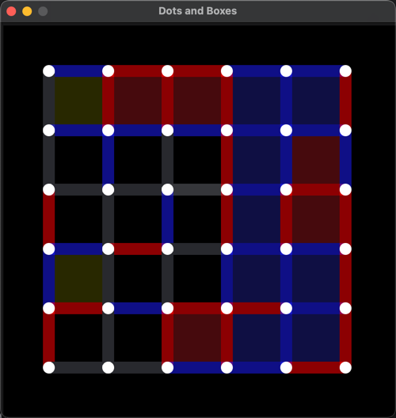

# Dots and Boxes

## Overview

"Dots and Boxes" is a classic game where two players take turns to connect dots on a grid to form boxes. This
implementation includes both a graphical user interface (GUI) using the Fyne library and an AI player that uses a Monte
Carlo simulation to determine the best moves.

## Features

- Interactive GUI built with Fyne.
- AI players for both Player 1 and Player 2.
- Real-time game logging.
- Configurable board size.
- Visual indicators for player moves and scores.



## Installation

### Prerequisites

- Go 1.18 or higher
- Fyne library
- colog library

### Steps

1. Clone the repository:
    ```sh
    git clone https://github.com/yourusername/dots-and-boxes.git
    cd dots-and-boxes
    ```

2. Install dependencies:
    ```sh
    go get fyne.io/fyne/v2
    go get github.com/HuXin0817/colog
    ```

3. Build and run the application:
    ```sh
    go build -o dots_and_boxes
    ./dots_and_boxes
    ```

## Usage

Upon running the application, a window will appear displaying the "Dots and Boxes" game board. Players (or AI) take
turns clicking on the edges to form boxes. The game will automatically log moves and scores.

### Configuration

The game can be configured by modifying the constants in the source code:

- `BoardSize`: The size of the game board (default is 6).
- `AIPlayer1`: Set to `true` if Player 1 is controlled by AI (default is `true`).
- `AIPlayer2`: Set to `true` if Player 2 is controlled by AI (default is `true`).

## Logging

The game logs all moves and scores in a file located in the `gamelog` directory. The log file is named with the current
date and time.

## License

This project is licensed under the terms of the MIT license.

## Acknowledgements

- [Fyne](https://fyne.io/) - A cross-platform GUI toolkit for Go.
- [colog](https://github.com/HuXin0817/colog) - A simple and colorful logger for Go.

## Contact

For any questions or suggestions, please contact [your-email@example.com](mailto:your-email@example.com).

### Notes:

1. **Prerequisites**: Ensure you list all necessary libraries and their installation commands.
2. **Steps**: These steps include cloning the repository, installing dependencies, and building the application.
3. **Usage**: Instructions on how to run the application and an example configuration.
4. **Logging**: Mention where the game logs are stored.
5. **License**: Specify the license under which the project is distributed.
6. **Acknowledgements**: Give credit to the libraries and tools used.
7. **Contact**: Provide a way for users to reach out with questions or suggestions.

Make sure to replace placeholders like `yourusername` and `your-email@example.com` with your actual GitHub username and
contact email.