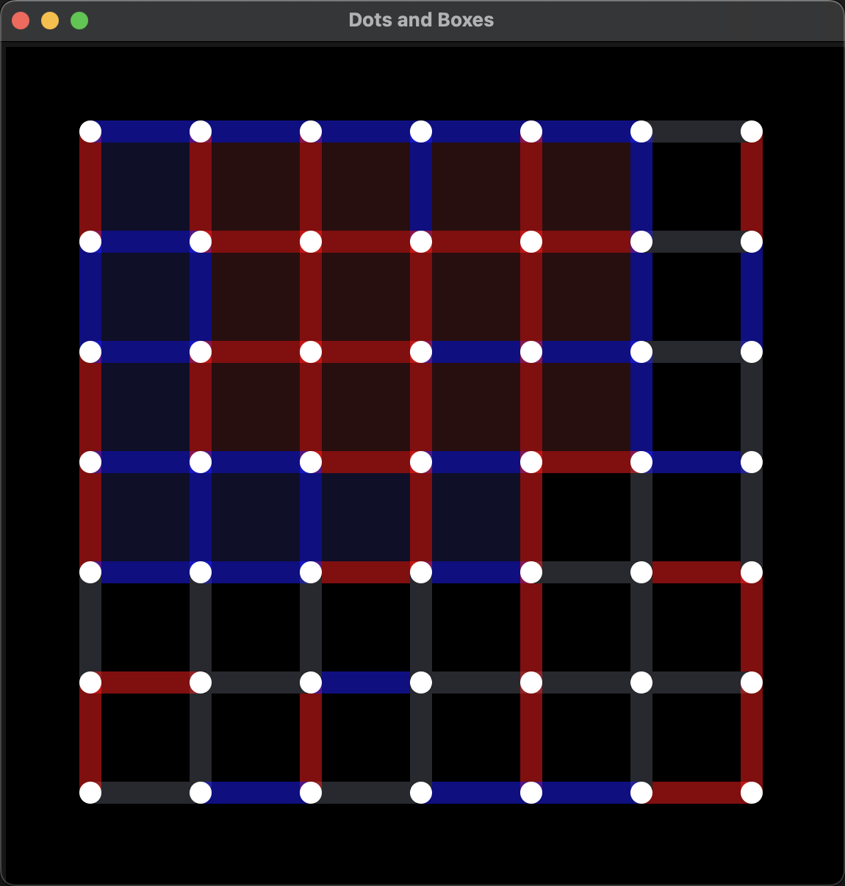

# Dots and Boxes

A distributed Chinese checker gaming system based on go-zero, fyne, Kafka, Redis, etcd, MongoDB, and gRPC.

## Demo



## Overview

The Distributed Dots and Boxes Gaming System is a sophisticated distributed gaming platform that facilitates engaging dots and boxes games across different nodes. It ensures real-time synchronization of game data, providing players with an immersive and seamless gaming experience in a distributed environment.

### Features

- **Real-time Data Synchronization:** Enables seamless synchronization of game data across distributed nodes, ensuring that all players have a consistent view of the game state.
- **Middleware Integration:** Integrated with various middleware technologies such as Kafka for messaging, etcd for service discovery, Redis for caching, and MongoDB for data storage, ensuring robustness and scalability of the system.
- **Scalable Architecture:** Designed with a scalable architecture to support multiple concurrent players, allowing for the expansion of the gaming platform as player demand grows.
- **Intuitive User Interface:** Provides an intuitive user interface that enhances the gaming experience, allowing players to easily interact with the system and enjoy the game.
- **Description:** Developed a distributed gaming platform using go-zero, Fyne, Kafka, Redis, etcd, MongoDB, and gRPC, facilitating various player combinations such as PvP, PvAI, and AIvAI. Key responsibilities and achievements include:
- **Client UI Design:** Designed a user-friendly UI using the Fyne framework, enabling intuitive interactions for different player modes.
- **Distributed Transaction Support:** Utilized middleware like Kafka, Redis, and etcd to ensure ACID properties for transactions, ensuring data consistency and reliability.
- **Battle Log Persistence:** Implemented MongoDB for storing battle logs, providing a basis for data analysis and operational decisions.
- **Timeout Handling and Circuit Breaking:** Implemented request timeouts and circuit breaking using Go's context package to ensure system stability.
- **gRPC API Design:** Designed efficient gRPC APIs to improve communication efficiency and scalability.
- **Search Algorithm Design:** Developed and optimized concurrent execution of the Alpha-Beta search algorithm, enhancing CPU utilization.
- **Docker Containerization Deployment:** Containerized the system using Docker technology for quick deployment and horizontal scaling.


## Installation

### Prerequisites

Before installing the Distributed Dots and Boxes Gaming System, ensure you have the following prerequisites installed:

- Go 1.18+
- Kafka
- etcd
- Redis
- MongoDB

### Installation Steps

Follow these steps to install the Distributed Dots and Boxes Gaming System:

1. **Clone the Repository:** 
```bash
$ git clone https://github.com/HuXin0817/dots-and-boxes.git
```

2. **Install Dependencies:** 
```bash
$ cd dots-and-boxes
$ make
```

3. **Configure Middleware Connections:** 
Configure middleware connections in the application according to your setup. This involves configuring connections to Kafka, etcd, Redis, and MongoDB.

## Usage


### Starting the Game Server

To start the Distributed Dots and Boxes Gaming System, follow these steps:

#### Game Engine:

```bash
$ make run-engine
```

#### Serve:

```bash
$ make run-serve
```

### User Interface:

```bash
$ make run-ui
```

## Architecture

The Distributed Dots and Boxes Gaming System comprises several key components:

- **Game Engine:** 
- Manages game logic, player interactions, and data synchronization.
- **Middleware Integration:** 
- Utilizes Kafka for messaging, etcd for service discovery, Redis for caching, and MongoDB for data storage.
- **User Interface:** 
- Provides an intuitive interface for users to interact with the system and play the game.

## Configuration

Configuration of middleware connections in the application can be done by modifying the corresponding configuration files or setting environment variables.

## Advanced Usage

For advanced usage or configuration options, refer to the project documentation or source code comments.

## Examples

Check out the examples directory within the project repository for usage examples and sample code snippets.

## Contributing

Contributions to the Distributed Dots and Boxes Gaming System are welcomed! Follow these steps to contribute:

1. Fork the repository.
2. Create a new branch: `git checkout -b feature-name`.
3. Make your changes and commit them: `git commit -am 'Add new feature'`.
4. Push to the branch: `git push origin feature-name`.
5. Submit a pull request.

## License

This project is licensed under the MIT License. See the [LICENSE](LICENSE) file for details.