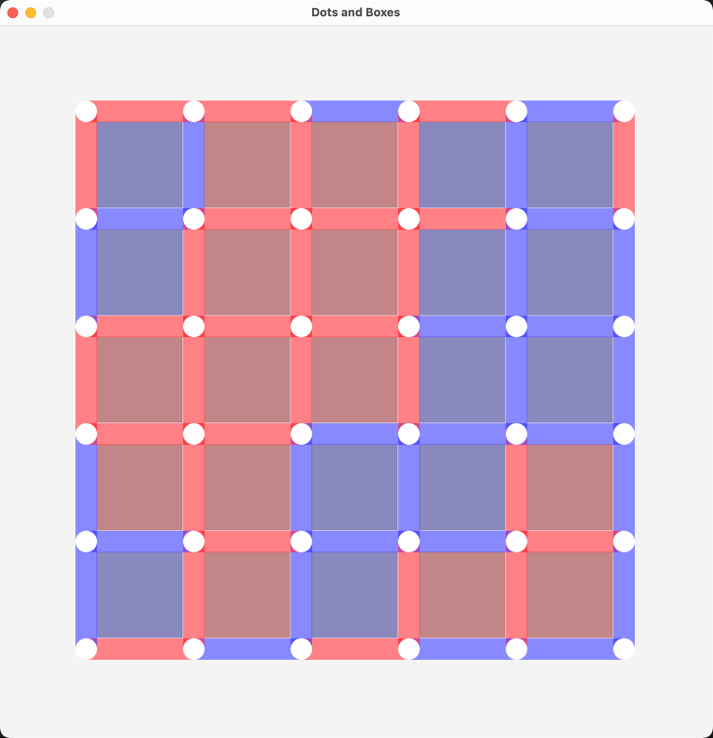

# Dots and Boxes Game

This project implements the classic Dots and Boxes game using the Fyne library for the UI in Go. The game supports both
human and AI players, with configurable board sizes and various features for enhanced gameplay experience.



## Features

- **Configurable Board Size**: The board size can be set from 1x1 to 12x12 using function keys (F1-F12).
- **AI Players**: The game supports AI players for both Player 1 and Player 2. You can configure AI players using the
  number keys (0–3).
- **Logging**: The game logs key events and actions to a log file. You can toggle logging on and off with the 'L' key.
- **Pause and Resume**: You can pause and resume the game using the Space key.
- **Theming**: The game adapts to the system's light and dark themes.

## How to Play

### Controls

- **Start/Close AIPlayer1**: `1` key
- **Start/Close AIPlayer2**: `2` key
- **Set the board size**: `F1-F12` to 1x1 up to 12x12.
- **Pause/Resume**: `Space` key.
- **Restart Game**: `R` key.
- **Toggle Logging**: `L` key.
- **Quit Game**: `Q` key.

### Gameplay

1. **Initialization**:

- Set the desired board size using function keys (F1-F12).
- Start a new game using number keys (0-3).

2. **Making Moves**:

- Click on the edge buttons to place edges.
- The AI players will automatically make moves if enabled.

3. **Winning**:

- The game ends when all edges are placed.
- The player with the most boxes filled wins.

## Installation

1. **Install Go**: Make sure Go is installed on your system. You can download it
   from [golang.org](https://golang.org/dl/).
2. **Clone Repository**: Clone this repository to your local machine.

```sh
git clone https://github.com/yourusername/dots-and-boxes.git
```

3. **Install Dependencies**: Navigate to the project directory and install the dependencies.

```sh
cd dots-and-boxes
go get fyne.io/fyne/v2
go get github.com/HuXin0817/colog
```

4. **Run the Game**: Execute the main Go file to start the game.

```sh
go run main.go
```

## Code Structure

- **main.go**: Contains the main logic and game loop.
- **Game Struct**: Defines the game state, including board, players, and UI elements.
- **Edge, Box, Dot Structs**: Represent the elements of the board.
- **AI Logic**: Implements AI strategies for making moves.

## Dependencies

- **Fyne**: A cross-platform GUI toolkit for Go.
- **colog**: A simple logging library for Go.

## Future Improvements

- Enhance AI strategies for more competitive gameplay.
- Add a save/load feature to persist game state.
- Improve UI for better user experience.

## License

This project is licensed under the MIT License.

---

Enjoy playing Dots and Boxes!